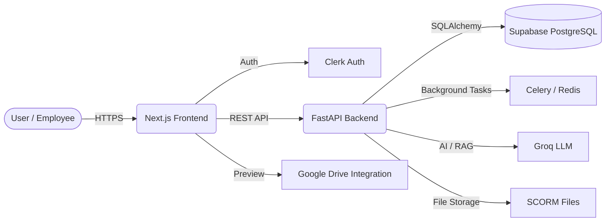

# Maple Intranet - Knowledge Transfer (KT) Document

Welcome to the **Maple Intranet** project! This document serves as a comprehensive guide for new developers joining the team. It covers the architecture, technology stack, codebase structure, key features, and development workflows.

---

## 1. Project Overview

**Project Name:** Maple Intranet
**Status:** In Development
**Purpose:** A production-ready internal company platform that consolidates an Employee Intranet, Document Management System (DMS), Learning Management System (LMS with SCORM & xAPI), and a Company AI Assistant into a single enterprise application.
**Problem Solved:** Fragmented internal tools. Instead of using separate platforms for HR, learning, documents, and calendar, Maple Intranet brings them together with a unified role-based access system.
**Target Users:** 
- **Employees:** Access documents, calendar, training courses, and AI assistant.
- **HR & Managers:** Manage employees, announcements, and team training.
- **Admins / Training Managers:** Upload SCORM courses, manage departments, system settings, and AI knowledge base.

### High-Level Architecture



---

## 2. Technology Stack

The project strictly separates the frontend (UI/UX) from the backend (Business Logic & Data).

### Frontend
- **Framework:** Next.js (App Router) + React
- **Language:** TypeScript
- **Styling:** Tailwind CSS + shadcn/ui
- **Icons & Components:** Lucide React, React Hook Form, Zod
- **Data Fetching:** TanStack Query (React Query)
- **Visuals:** Recharts (Analytics), FullCalendar (Company Calendar)

### Backend
- **Framework:** FastAPI (Python)
- **Language:** Python 3
- **ORM:** SQLAlchemy 2.0 (Asyncpg) + Alembic (Migrations)
- **Task Queue:** Celery + Redis (for background jobs like SCORM parsing)
- **AI Processing:** Groq API + pgvector (for embeddings/RAG)

### Infrastructure & Database
- **Primary Database:** Supabase (PostgreSQL) - The single source of truth.
- **Authentication:** Clerk (Handles Login, Sessions, JWTs). The backend verifies Clerk tokens.

---

## 3. Project Structure and Navigation

The repository is divided into two independent, separately deployable codebases.

```text
maple-intranet/
├── frontend/                 # Next.js Application
│   ├── app/                  # App Router pages (e.g., (dashboard), admin, sign-in)
│   ├── components/           # Reusable UI components (shadcn/ui, custom cards)
│   ├── hooks/                # React hooks (e.g., useAuth)
│   ├── lib/                  # Utilities (e.g., api clients, documentUtils.ts)
│   ├── public/               # Static assets
│   └── package.json          # Frontend dependencies
│
├── backend/                  # FastAPI Application
│   ├── alembic/              # Database migration scripts
│   ├── app/                  # Main backend source code
│   │   ├── api/              # API Route definitions (controllers)
│   │   ├── core/             # Config, security, DB setup
│   │   ├── models/           # SQLAlchemy DB Models (learning, core, document)
│   │   ├── schemas/          # Pydantic schemas (Validation)
│   │   ├── services/         # Business logic layer
│   │   └── scorm/            # SCORM parsing and extraction logic
│   ├── requirements.txt      # Python dependencies
│   └── .env                  # Backend environment variables
│
├── Design.md                 # UI/UX Design System Guidelines
└── dployment.md              # Deployment Guide
```

### Important Rule: Separation of Concerns
- **Frontend** is purely for presentation and state management. It should NOT contain complex business logic or direct database connections.
- **Backend** is the source of truth for all business logic, permissions, and data integrity.

---

## 4. Database Models (Supabase PostgreSQL)

We use **SQLAlchemy 2.0** for modeling our PostgreSQL database. Alembic handles schema migrations. 

Key domains modeled in `backend/app/models/`:
1. **Core (`core.py`):** `users`, `employees`, `roles`, `departments`. (RBAC)
2. **Documents (`document.py`):** `document_categories`, `documents`, `document_permissions`.
3. **Learning (`learning.py`):** `courses`, `course_enrollments`, `scorm_packages`, `scorm_tracking`.
4. **AI (`ai.py`):** `knowledge_documents`, `knowledge_embeddings` (uses `pgvector`).

*Tip for Interns:* If you need to add a new column to a table, you must edit the model class in Python and run an Alembic migration (`alembic revision --autogenerate -m "Add column"`). Do NOT edit the database directly in the Supabase UI.

---

## 5. Key Features & Business Logic

### A. Authentication & RBAC (Role-Based Access Control)
Authentication is offloaded to **Clerk**. 
- **Flow:** User logs in via Clerk on the frontend. Next.js passes the Clerk JWT token to the FastAPI backend. The backend's `core/security.py` verifies the token and identifies the user.
- **Roles:** The DB defines roles (`SUPER_ADMIN`, `ADMIN`, `HR`, `EMPLOYEE`, etc.). Backend endpoints check these roles before allowing actions. Do not trust frontend role checks for security!

### B. Document System (Google Drive Integrated)
The intranet acts as a central hub for company documents, but the files themselves live in Google Drive.
- We store metadata (Title, Category, Department, Drive URL) in our database.
- The frontend embeds a Google Drive preview iframe.
- Document access permissions (e.g., "Only HR can view") are strictly enforced by the backend API.

### C. SCORM Learning Management System (LMS)
This is a complex module! We support **SCORM 1.2**.
- **Upload Flow:** Admins upload a `.zip` SCORM file. The backend validates it, parses the `imsmanifest.xml`, and extracts the launch HTML file.
- **Player:** The frontend loads the extracted SCORM course inside an iframe.
- **Tracking:** As the user interacts with the course, the iframe fires SCORM API events (like `LMSSetValue`). The frontend captures these and sends them to our backend, tracking progress (`lesson_status`, `score`, `suspend_data`).

### D. AI Assistant (RAG Platform)
Employees can chat with a company AI Assistant powered by **Groq**.
- The backend embeds company documents into vectors and stores them in Supabase (using `pgvector`).
- When a user asks a question, the backend retrieves relevant context from the DB and sends it to the Groq LLM to generate an accurate, company-specific answer.

---

## 6. Design System & UI

We follow a premium, enterprise SaaS design aesthetic detailed in `Design.md`.
- **Typography:** Euclid Circular A (primary), Source Code Pro (code).
- **Colors:** Deep Teal hero bands with bright Green CTAs.
- **Shapes:** Pill-shaped buttons (`rounded-full`) and 12px rounded cards (`rounded-lg`).
- **Guidelines:** Do not use heavy glassmorphism or childish UI. Maintain clean layouts with subtle borders and shadows. Rely on Tailwind CSS and predefined `shadcn/ui` components for consistency.

---

## 7. Developer Workflow & Setup

### Local Setup (Backend)
1. Navigate to the `backend` folder.
2. Create a virtual environment: `python -m venv venv`
3. Activate it: `venv\Scripts\activate` (Windows) or `source venv/bin/activate` (Mac/Linux)
4. Install dependencies: `pip install -r requirements.txt`
5. Copy `.env.example` to `.env` and fill in the values (Supabase `DATABASE_URL`, `GROQ_API_KEY`).
6. Run migrations: `alembic upgrade head`
7. Start server: `uvicorn app.main:app --reload` (Runs on `localhost:8000`)

### Local Setup (Frontend)
1. Navigate to the `frontend` folder.
2. Install dependencies: `npm install`
3. Setup environment variables in `.env.local` (Clerk keys, `NEXT_PUBLIC_API_URL=http://localhost:8000`).
4. Start dev server: `npm run dev` (Runs on `localhost:3000`)

### Coding Guidelines for Interns
- **Frontend State:** Use TanStack Query (React Query) for fetching data from the backend. Avoid `useEffect` for data fetching where possible.
- **TypeScript:** Avoid `any` types. Define proper Zod schemas and TypeScript interfaces for API responses.
- **Backend Validation:** Always use Pydantic models in FastAPI to validate incoming request bodies.
- **Missing Information?** If a feature's requirements are unclear, mark it as `TODO / Needs Confirmation` and clarify with the product manager or senior engineer before building.

---

## 8. Deployment (Overview)
- **Frontend** is deployed on **Vercel** for optimal Next.js performance and edge routing.
- **Backend** is deployed on **Render** (or similar PaaS) to run the Python FastAPI app.
- Ensure CORS in FastAPI allows requests from the Vercel production URL. 
- Refer to `dployment.md` for step-by-step production rollout instructions.
